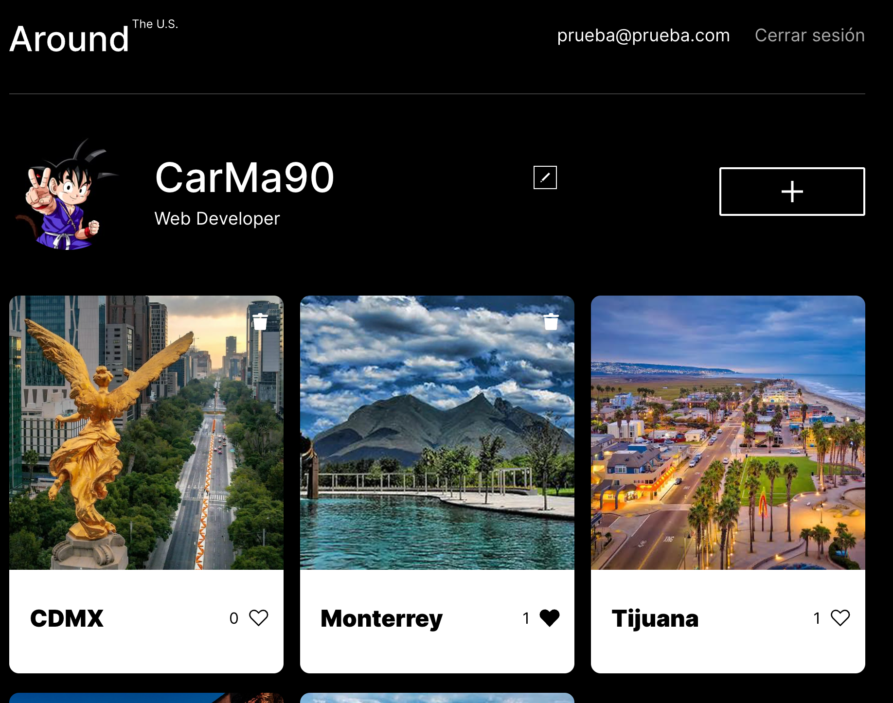
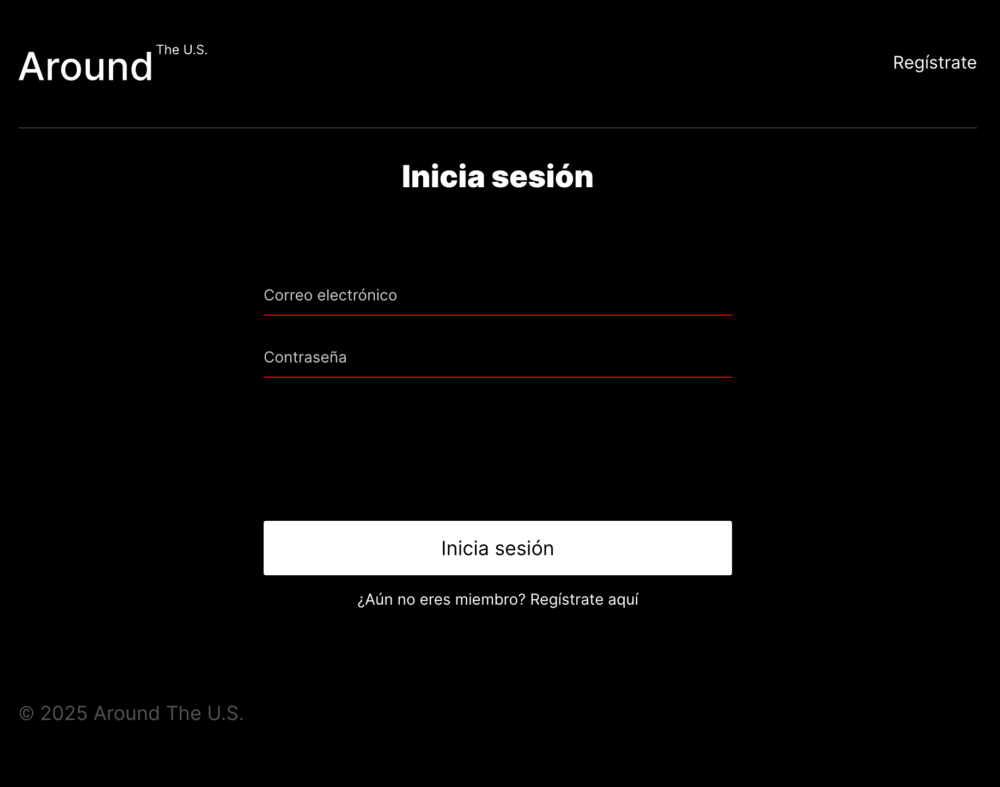
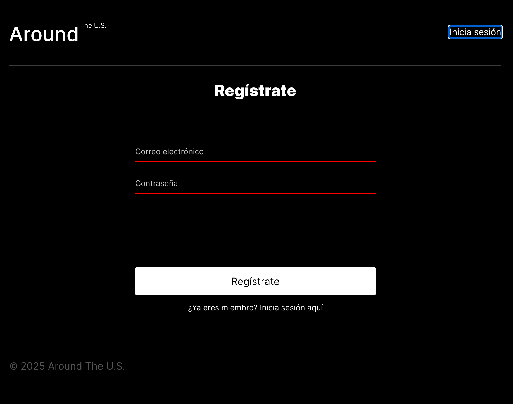
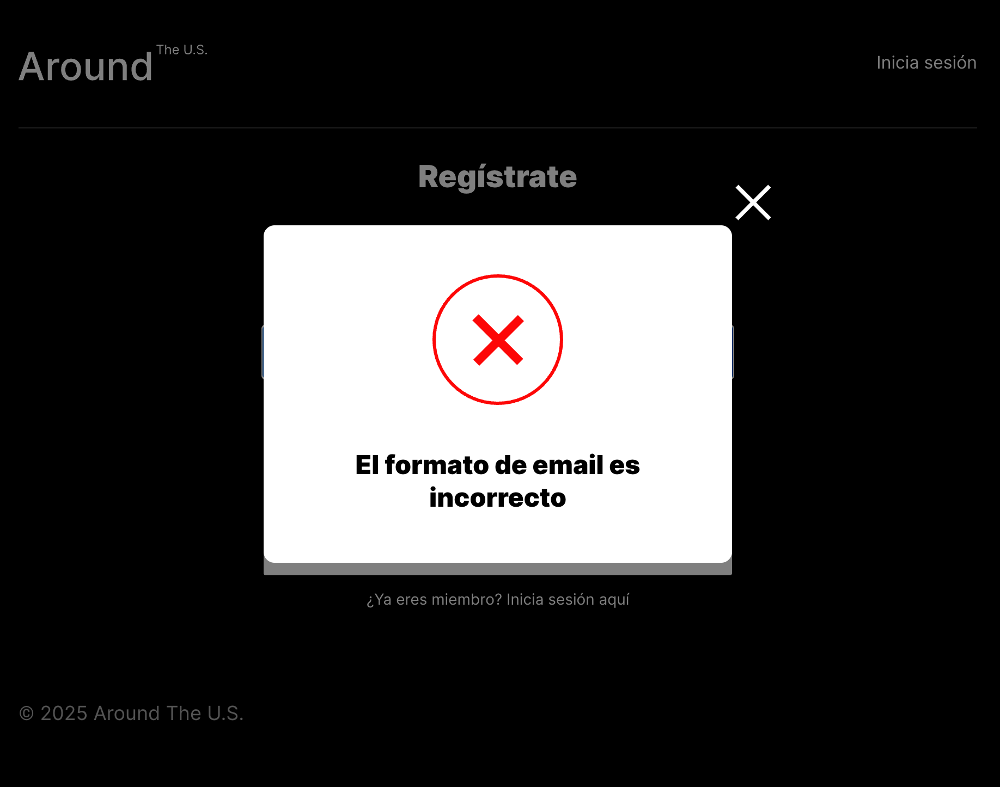

# Around the World

> Una red social para descubrir lugares, compartir fotografías y conectar con otros viajeros.

Aplicación full-stack desarrollada con React y Node.js. Cada usuario puede crear su perfil, publicar tarjetas con fotografías de lugares del mundo y participar en la comunidad mediante likes.

[](https://www.ils.heise.cl)
[](https://www.loom.com/share/131f676a5b6d49e98852a91e4654e9d1)

## Vista previa

<table>
	<tr>
		<td width="50%"></td>
		<td width="50%"></td>
	</tr>
	<tr>
		<td align="center"><strong>Explora lugares y fotografías</strong></td>
		<td align="center"><strong>Acceso seguro a la comunidad</strong></td>
	</tr>
	<tr>
		<td width="50%"></td>
		<td width="50%"></td>
	</tr>
	<tr>
		<td align="center"><strong>Crea tu cuenta</strong></td>
		<td align="center"><strong>Mensajes de error claros</strong></td>
	</tr>
</table>

## Índice

- [Vista previa](#vista-previa)
- [Puntos fuertes](#puntos-fuertes)
- [Funcionalidades](#funcionalidades)
- [Tecnologías](#tecnologías)
- [Estructura del proyecto](#estructura-del-proyecto)
- [Ejecución local](#ejecución-local)
- [API principal](#api-principal)
- [Enlaces](#enlaces)

## Puntos fuertes

- **Experiencia completa de usuario:** registro, inicio de sesión, sesión persistente y navegación protegida.
- **Frontend componentizado:** interfaz React organizada por componentes, contextos y vistas reutilizables.
- **API REST segura:** autenticación mediante JWT, contraseñas protegidas con `bcryptjs` y autorización en las rutas privadas.
- **Reglas de negocio claras:** un usuario solo puede eliminar sus propias tarjetas y los likes no se duplican.
- **Datos consistentes:** validaciones con `Joi`, `Celebrate`, Mongoose y `validator` antes de procesar las solicitudes.
- **Manejo profesional de errores:** errores HTTP personalizados, respuesta para rutas inexistentes y registro de peticiones y fallos con Winston.

## Funcionalidades

### Para usuarios

- Crear una cuenta e iniciar sesión.
- Mantener la sesión activa mediante un token JWT almacenado localmente.
- Consultar y editar el nombre, la descripción y el avatar del perfil.
- Cerrar sesión desde el menú de usuario.

### Para tarjetas

- Consultar las fotografías publicadas por la comunidad.
- Crear tarjetas con nombre y enlace de imagen.
- Marcar y quitar likes.
- Abrir las imágenes en una vista ampliada.
- Eliminar únicamente las tarjetas propias.

## Tecnologías

### Frontend

- React 19
- React Router
- Vite
- JavaScript (JSX)
- CSS organizado por bloques y componentes

### Backend

- Node.js y Express
- MongoDB con Mongoose
- JWT y bcryptjs para autenticación
- Celebrate y Joi para validación de solicitudes
- CORS y dotenv para configuración de la aplicación
- Winston y Express Winston para logging

## Estructura del proyecto

```text
.
├── backend/
│   ├── controllers/     # Lógica de usuarios y tarjetas
│   ├── errors/          # Errores HTTP personalizados
│   ├── middlewares/     # Autenticación, validación y logs
│   ├── models/          # Esquemas de MongoDB
│   └── routes/          # Endpoints de la API
└── frontend/
	└── src/
		├── components/  # Vistas y componentes React
		├── contexts/    # Estado compartido
		├── utils/       # API, autenticación y token
		└── blocks/      # Estilos por sección
```

## Ejecución local

### Requisitos

- Node.js 18 o superior
- MongoDB ejecutándose en `mongodb://localhost:27017/aroundb`

### Backend

```bash
cd backend
npm install
npm run dev
```

El servidor se inicia en `http://localhost:3000` por defecto. Para producción, define `PORT`, `NODE_ENV` y `JWT_SECRET` en un archivo `.env`.

### Frontend

```bash
cd frontend
npm install
npm run dev
```

El frontend publicado está configurado para consumir `https://api.ils.heise.cl/`. Para trabajar con un backend local, actualiza esa URL en `frontend/src/utils/api.js` y `frontend/src/utils/auth.js`.

Otros comandos útiles:

```bash
npm run build   # Genera la versión de producción
npm run lint    # Comprueba el código con ESLint
npm run preview # Previsualiza el build
```

## API principal

| Método           | Endpoint               | Descripción                     |
| ---------------- | ---------------------- | ------------------------------- |
| `POST`           | `/signup`              | Registra un usuario             |
| `POST`           | `/signin`              | Inicia sesión y devuelve un JWT |
| `GET`            | `/users/me`            | Obtiene el perfil autenticado   |
| `PATCH`          | `/users/me`            | Actualiza el perfil             |
| `PATCH`          | `/users/me/avatar`     | Actualiza el avatar             |
| `GET`            | `/cards`               | Lista las tarjetas              |
| `POST`           | `/cards`               | Crea una tarjeta                |
| `DELETE`         | `/cards/:cardId`       | Elimina una tarjeta propia      |
| `PUT` / `DELETE` | `/cards/:cardId/likes` | Añade o quita un like           |

Las rutas de usuarios y tarjetas requieren el encabezado `Authorization: Bearer <token>`.

## Enlaces

- **Aplicación:** [www.ils.heise.cl](https://www.ils.heise.cl)
- **Demostración:** [ver video en Loom](https://www.loom.com/share/131f676a5b6d49e98852a91e4654e9d1)
- **Repositorio del backend:** [web_project_around_express](https://github.com/CarMa90/web_project_around_express)
